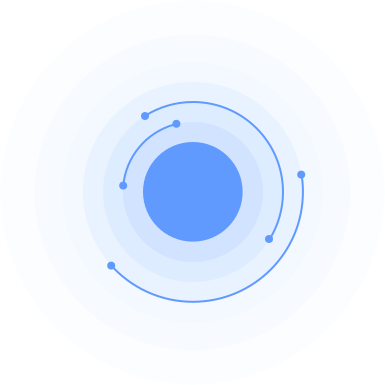

[![Issues][issues-shield]][issues-url]
[![MIT License][license-shield]][license-url]

<!---->

# Pale Blue
<!-- PROJECT LOGO -->
 

  

  <h3 align="center">Serious Game</h3>

  

    Discover your own world in a 'planetary test tube'. Follow and decide the course of the geographical history of a planet with its inhabitants from a cosmic perspective.
     
    <a href="https://kerrybartels.de/Bartels_Kerry_Thesis.pdf"><strong>explore master's thesis [GER] »</strong></a>
     
     
    <a href="https://paleblue.webflow.io">More Info</a>
    ·
    <a href="https://github.com/kerryon/PaleBlue/issues">Report Bug</a>
    ·
    <a href="https://github.com/kerryon/PaleBlue/issues">Request Feature</a>
  

<!-- ABOUT THE PROJECT -->
## About The Project

  

---

The serious game of geography from a ***cosmic perspective***.

A mobile learning experience on your own smartphone - inside and also outside the classroom. Help a planet to manage its life and discover the vast dimensions, meanings and action spaces of the life-defining element of ***water***.

### Built With

* [Unity](https://unity.com)

#### Asset dependencies

* [Space Graphics Toolkit](https://assetstore.unity.com/packages/tools/level-design/space-graphics-toolkit-4160)
* [Lean Touch+](https://assetstore.unity.com/packages/tools/input-management/lean-touch-72356)
* [Easy Save](https://assetstore.unity.com/packages/tools/utilities/easy-save-the-complete-save-data-serialization-asset-768)
* [Scribble Drivel](https://assetstore.unity.com/packages/tools/gui/scribble-drivel-runtime-drawing-tool-140699)

<!-- LICENSE -->
## License

This work is licensed under a **GPL-3.0** license. See `LICENSE` for more information.

<!-- CONTACT -->
## Contact
:love_letter: — [kerrybartels@web.de](mailto:kerrybartels@web.de?subject=[GitHub]%20Pale%20Blue)

:globe_with_meridians: — [https://paleblue.webflow.io/](https://paleblue.webflow.io)

:link: — [https://github.com/kerryon/PaleBlue](https://github.com/kerryon/PaleBlue)

<!-- REF -->
[issues-shield]: https://img.shields.io/github/issues/kerryon/PaleBlue.svg?style=for-the-badge
[issues-url]: https://github.com/kerryon/PaleBlue/issues
[license-shield]: https://img.shields.io/github/license/kerryon/PaleBlue.svg?style=for-the-badge
[license-url]: https://github.com/kerryon/PaleBlue/blob/main/LICENSE.md
